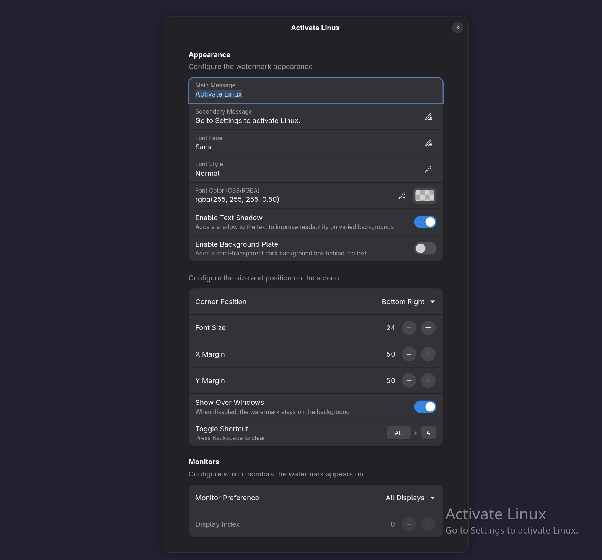

# Activate Linux

A GNOME extension that adds an "Activate Linux" watermark to your desktop, inspired by the "Activate Windows" watermark.

## Features

- Customizable text (Main and secondary messages)
- Customizable appearance (Font face, style, size, color, text shadow, and background plate)
- Customizable positioning (Corner selection, X and Y margins)
- Multi-monitor support (Primary only, all monitors, or specific monitor index)
- Display mode options (Show on desktop background only, overlay on top of all windows, and show on lock screen)
- Custom keyboard shortcut support to toggle window overlay mode (default: `<Super><Alt>w`)
- Works on both X11 and Wayland

## Installation

### From GNOME Extensions

(Coming soon)

### Manual Installation

1. Clone the repository:
   ```bash
   git clone https://github.com/bbbenji/gnome-shell-extension-activate-linux.git
   ```
2. Navigate to the extension directory:
   ```bash
   cd activate-linux
   ```
3. Compile the schemas:
   ```bash
   glib-compile-schemas schemas/
   ```
4. Copy the extension files to your local extension directory:
   ```bash
   ext_dir="$HOME/.local/share/gnome-shell/extensions/activate-linux@bbbenji"
   mkdir -p "$ext_dir"
   cp -r * "$ext_dir"/
   ```
5. Restart GNOME Shell:
   - **X11**: Press `Alt` + `F2`, type `r`, and press `Enter`.
   - **Wayland**: Log out and log back in.
6. Enable the extension via the Extensions app or using the command line:
   ```bash
   gnome-extensions enable activate-linux@bbbenji
   ```

## Configuration

You can configure the extension's behavior and appearance using the GNOME Extensions app or Extension Manager. Click the settings gear icon next to "Activate Linux" to access the preferences.

The settings are divided into the following categories:

### Text Settings

- **Main Message**: The primary text displayed in the watermark (default: "Activate Linux").
- **Secondary Message**: The secondary text displayed below the main message (default: "Go to Settings to activate Linux.").

You can use the following dynamic placeholders in your messages:

- `{{OS}}`: Your operating system name (e.g., Ubuntu, Fedora)
- `{{KERNEL}}`: Your current Linux kernel version
- `{{DE}}`: Your current desktop environment (e.g., GNOME)
- `{{WAYLAND_X11}}`: Your current windowing system ("wayland" or "x11")
- `{{WAYLAND}}`: Returns "Wayland" if you are currently using Wayland, otherwise empty.
- `{{X11}}`: Returns "X11" if you are currently using X11, otherwise empty.

### Font & Colors

- **Font Face**: The font family to use for the watermark (e.g., "Sans").
- **Font Style**: The font style to use (e.g., "Normal", "Italic").
- **Font Size**: The font size of the main message in points.
- **Font Color**: The color of the watermark text. You can use standard CSS formats like `rgba(255, 255, 255, 0.5)`.
- **Enable Text Shadow**: Adds a subtle shadow to the text for better readability against light backgrounds.
- **Enable Background Plate**: Adds a dark translucent background behind the text.

### Layout & Position

- **Monitor Preference**: Choose which monitor(s) to display the watermark on ("Primary Monitor", "All Monitors", or a "Specific Monitor").
- **Monitor Index**: If "Specific Monitor" is selected, specify the index of the monitor (starts at 0).
- **Corner Position**: Choose which corner of the screen to display the watermark (Bottom Right, Bottom Left, Top Right, Top Left).
- **X Position**: The horizontal distance (margin) from the selected corner edge.
- **Y Position**: The vertical distance (margin) from the selected corner edge.

### Behavior

- **Show over all windows**: When enabled, the watermark overlays all open windows. When disabled, it stays on the desktop background.
- **Show on Lock Screen**: When enabled, the watermark is visible when the screen is locked.
- **Toggle overlay shortcut**: A customizable keyboard shortcut to quickly toggle the "Show over all windows" behavior (default: `<Super><Alt>w`).

## Screenshots

<a href="images/screenshot.png">
  
</a>
